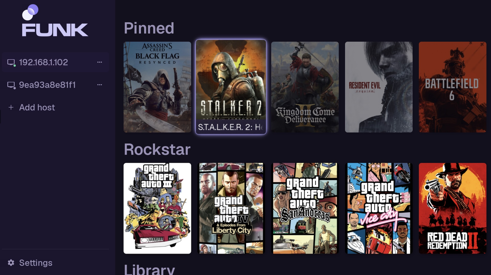
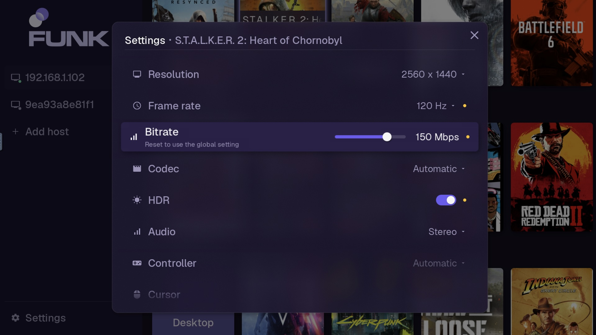

 
 

**Native LG webOS TV client for [punktfunk](https://git.unom.io/unom/punktfunk) — low-latency desktop & game streaming.**

---

Targets webOS 5.x+ (developed and verified live on an **LG CX, webOS 5.6**), packaged as a homebrew
`.ipk`. Built directly on the upstream `punktfunk-core` crate (a pinned git dependency — see
`Cargo.toml`).

Built on the [punktfunk](https://git.unom.io/unom/punktfunk) project by **Enrico Bühler
([unom](https://unom.io))** — all credit for the protocol, FEC/crypto core, and host implementation
belongs there. This repo is only the webOS-specific client: an SDL2 UI, NDL DirectMedia hardware
video decode, and webOS packaging.

## Features

- LAN discovery (mDNS) or add a host manually by IP; PIN pairing with persisted trust, and a
  live reachability dot on every host so an offline machine is visible before you try it.
- Per-host actions behind a ⋯ button on each host row: connect, pair, **network speed test**
  (measures over the real data plane and applies a recommended bitrate in one press), wake,
  edit address, forget.
- Configurable resolution (1080p/1440p/4K), frame rate, bitrate, HDR, and audio channels
  (stereo / 5.1 / 7.1).
- Browses the host's game library (with cover art, alphabetically sorted) and launches
  straight into a title.
- About & licenses screen with the build version and full third-party notices.
- Hardware H.264/H.265 decode via webOS's NDL DirectMedia API; audio via SDL2/PulseAudio.
- Gamepad feedback back to the controller — rumble for any pad, plus DualSense adaptive triggers,
  haptics and lightbar. **Requires a newer webOS version** (see note below).
- Magic Remote friendly: d-pad navigation, pointer hover/click, number-pad PIN/IP entry, and the
  Red button as a Back/disconnect substitute.

> **Controller feedback needs newer webOS version.** Rumble, DualSense triggers, haptics and lightbar all
> rely on the kernel's `hid-playstation` driver, which LG ships only on latest webOS versions 24+.
> On webOS 5.x (e.g. the CX) the pad still works as an *input*, but no feedback reaches it.

<b>Screenshots</b>

  
  
  

## Installing

**Via Homebrew Channel** (recommended — installs/updates from the TV, no laptop needed):

1. Install [Homebrew Channel](https://www.webosbrew.org/) on the TV.
2. Homebrew Channel → Configuration → Add repository →
   `https://raw.githubusercontent.com/dyptan-io/punktfunk-webos/main/repo.json`
3. punktfunk now appears in the Homebrew Channel app list.

Only published [GitHub Releases](https://github.com/dyptan-io/punktfunk-webos/releases) appear this way —
dev/CI builds don't.

**Directly onto a TV** (Developer Mode required): `task deploy TV_HOST=root@<tv-ip>`.

## Development

Everything is a [go-task](https://taskfile.dev) target. The bare `build`/`check`/`lint`/`package`
targets run natively and need a Linux-aarch64 host with Rust installed (that's how CI runs). For
**local dev, use the `docker:*` variants** — they run the same logic in an ephemeral `docker run`,
so **only Docker is required, no local Rust/NDK install** (the webOS cross-toolchain ships
Linux-aarch64-only; works on amd64 hosts too via QEMU). Run `task --list` for everything.

| Task | What it does |
| --- | --- |
| `task docker:package` | Build + package `dist/*.ipk` — the one you usually want |
| `task docker:build` / `task docker:check` | Faster inner loop: compile only, or `cargo check` only |
| `task docker:lint` / `task fmt` | `cargo clippy` / `cargo fmt` |
| `task deploy TV_HOST=root@<tv-ip>` | Build, package, install, and launch on a real TV (via [ares-cli-rs](https://github.com/webosbrew/ares-cli-rs)) |
| `task deploy TV_HOST=... TELEMETRY=auto` | Same, but streams the app's logs live to this machine instead of a file on-device |
| `task clean` | Remove build output and caches |

Drop the `docker:` prefix (`task package`, `task lint`, …) to run natively on a Linux-aarch64 box.

**Build optimization**: Dev builds use thin LTO for speed (~2-3x faster iteration). For final release builds optimized for weak TV hardware, append `RELEASE_LTO=fat` to any build task: `task docker:package RELEASE_LTO=fat` or `task deploy TV_HOST=... RELEASE_LTO=fat`.

Set `TV_HOST` once in a local `.env` (copy `.env.example`) to skip typing it each time — it's the
only thing `deploy` needs: it installs the `ares-*` binaries on first use and registers the TV from
it (root over ssh on port 22). ares ignores `~/.ssh/config`, so set `SSH_KEY` in `.env` if your key
isn't `~/.ssh/id_rsa`. Architecture
and on-device gotchas live in [`docs/NOTES.md`](docs/NOTES.md) and `CLAUDE.md`.

## License

Dual-licensed under [MIT](LICENSE-MIT) or [Apache 2.0](LICENSE-APACHE), matching upstream punktfunk,
at your option.
